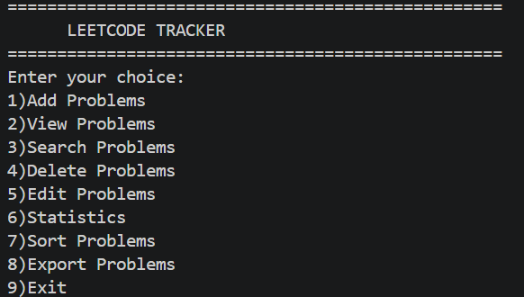
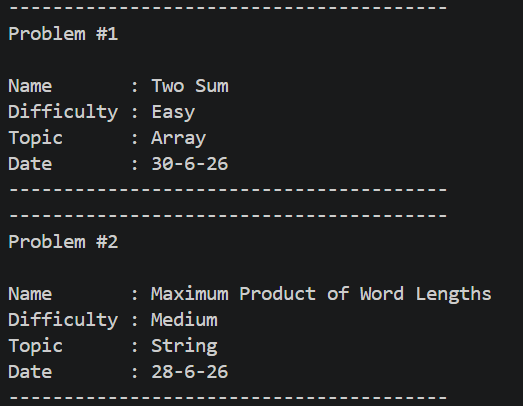

# 🧩 LeetCode Tracker

A command-line application built with Python to help track solved LeetCode problems. It allows users to add, edit, delete, search, sort, and export problems while storing data locally in a JSON file.

This project was built to practice Python fundamentals such as functions, file handling, JSON, lists, dictionaries, sorting, searching, and input validation.

---

## ✨ Features

- ➕ Add new LeetCode problems
- 📋 View all saved problems
- 🔍 Search problems by:
  - Problem Name
  - Difficulty
  - Topic
- ✏️ Edit existing problems
- 🗑️ Delete problems
- 📊 View statistics
  - Total problems solved
  - Easy problems
  - Medium problems
  - Hard problems
- 🔄 Sort problems by:
  - Problem Name
  - Difficulty
  - Topic
  - Date
- 📤 Export problems to JSON
  - Export all problems
  - Export by difficulty
  - Export by topic
- 💾 Automatic JSON data persistence

---

## 🛠️ Technologies Used

- Python 3
- JSON
- File Handling
- Lists & Dictionaries
- Functions
- Exception Handling

---

## 📂 Project Structure

```
Leetcode_Tracker/
│
├── Main.py          # Main application
├── data.json        # Stores all problems
├── README.md
```

---

## 🚀 How to Run

1. Clone this repository

```bash
git clone https://github.com/SanskarArnale-07/Leetcode_Tracker
```

2. Open the project folder

3. Run

```bash
python Main.py
```

---

## 📸 Screenshots

### Main Menu



### Viewing Problems



---

## 📚 Concepts Practiced

This project helped me practice:

- Functions
- Lists
- Dictionaries
- List Comprehensions
- Lambda Functions
- File Handling
- JSON
- Searching Algorithms
- Sorting with `key`
- Input Validation
- Exception Handling
- Code Reusability

---

## 🔮 Future Improvements

- Export to CSV
- Export to PDF
- Better date formatting
- SQLite database
- Flask web version
- Frontend interface

---

## 👨‍💻 Author

**Sanskar Arnale**

This is one of my beginner Python projects created while learning Python and improving my problem-solving skills.